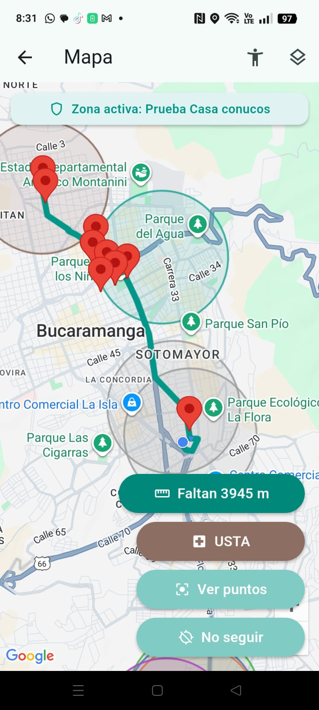
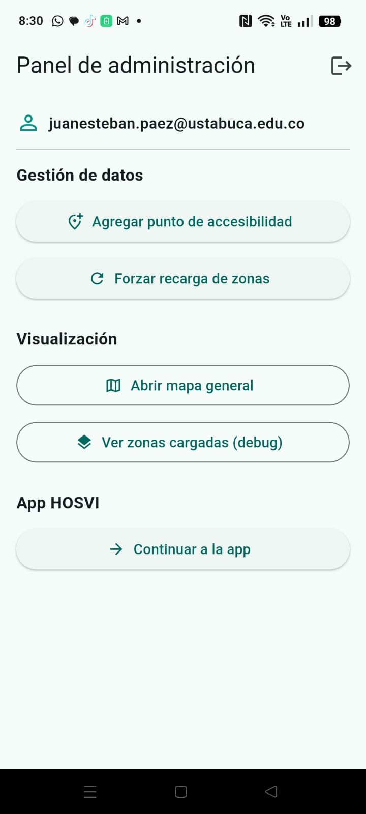
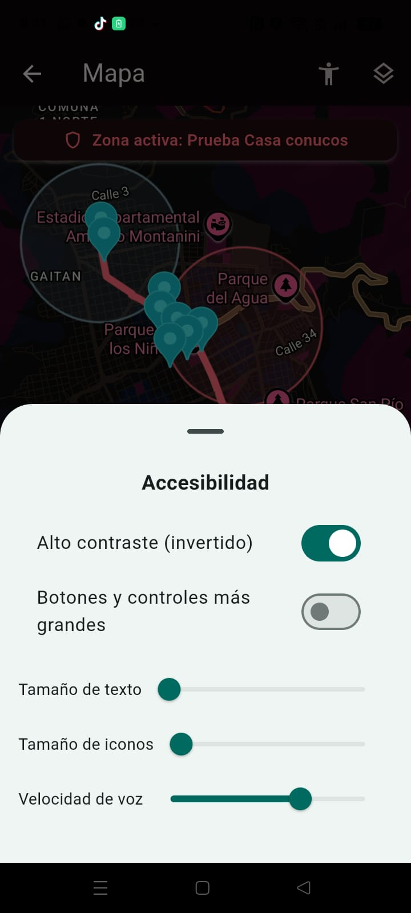

<h1 align="center">🧭 HOSVI_APP</h1>
<p align="center"><em>Empowering Accessibility, Transforming Healthcare Navigation</em></p>

<p align="center">
  
  
  
</p>

<p align="center">Built with the tools and technologies:</p>

<p align="center">
  
  
  
  
  
  
  
  
  
  
  
</p>

---

## 📘 Table of Contents
- [Overview](#overview)
- [Features](#features)
- [Getting Started](#getting-started)
  - [Prerequisites](#prerequisites)
  - [Installation](#installation)
  - [Running the App](#running-the-app)
- [Project Structure](#project-structure)
- [Environment Configuration](#environment-configuration)
- [Build & Release](#build--release)
- [Tech Stack](#tech-stack)
- [Privacy Policy](#privacy-policy)
- [License](#license)

---

## 🩺 Overview

**HOSVI_APP** is an accessibility-focused mobile system designed to **guide visually impaired users across hospital environments and surrounding areas**.  
It integrates **geolocation, tactile feedback, TTS voice guidance, Google Maps**, and **geofencing**, delivering a reliable outdoor hospital navigation experience.

This project uses **Flutter**, **Firebase Authentication**, **Firestore**, and multiple **Google Cloud APIs**.

---
---

## 📸 Screenshots

<p align="center"> <strong>Vista principal del mapa — navegación accesible</strong><br><br>  </p> <p align="center"> <strong>Panel de administración — gestión de zonas y puntos</strong><br><br>  </p> <p align="center"> <strong>Opciones de accesibilidad — alto contraste, tamaño y velocidad de voz</strong><br><br>  </p>

---

## ⭐ Features

- 🧭 **Outdoor Navigation Around Hospitals**
- 🎙️ **Voice-Guided TTS Instructions (8m approaching / 2m arrived)**
- 📍 **Accessibility POIs (rampas, cruces, aceras, entradas)**
- 🌐 **Google Maps + Directions API**
- 🔐 **Firebase Role-Based Authentication**
- ☁️ **Firestore Storage**
- 🛠️ **Modular architecture for extending POIs or zones**

---

## 🚀 Getting Started

### Prerequisites

- Flutter 3.x+
- Android Studio
- Firebase Project
- Google Cloud Project with:
  - Maps SDK
  - Directions API
- API keys configured

---

## 🔧Installation

```bash
git clone https://github.com/JCodeMasterJ/Hosvi_App
cd Hosvi_App
flutter pub get
```
---

## ▶️ Running the App

Debug build:
```bash
flutter run --dart-define=MAPS_API_KEY="TU_API_KEY"
```
Wireless debugging:
```bash
adb pair <ip:port>
adb connect <ip:port>
flutter run
```
---

## 🗂️ Project Structure

```bash
/lib
  /controllers          → lógica de navegación, rutas, TTS
  /models               → POIs, usuarios, zonas
  /ui                   → pantallas principales
/android
  google-services.json  → config Firebase
  build.gradle          → firma, maps api key
/assets
pubspec.yaml            → dependencias

```
---

## 🌍 Environment Configuration

La app requiere tres configuraciones externas obligatorias:
- 1️⃣ Firebase
- 2️⃣ Google Cloud APIs
- 3️⃣ MAPS_API_KEY en Android

### 1. Firebase Setup

- Crear proyecto en Firebase Console

- Habilitar:

  - Authentication (Email/Password)

  - Cloud Firestore

- Registrar app Android con paquete:

```bash
com.hosvi.app
```
- Descargar google-services.json y colocarlo en:
```bash
android/app/google-services.json
```
- Actualizar bindings FlutterFire (si fuese necesario):
```bash
flutterfire configure
```
### 2. Google Cloud APIs

Habilitar desde Google Cloud Console → API & Services → Library:

- ✔ Maps SDK for Android

- ✔ Directions API

- ✔ Geocoding API (opcional)

Crear una API Key y asignarle restricciones:

- “HTTP referrers” → para Web (si aplica)

- “Android apps” → con firma SHA-1 + package name

- “API restrictions” → Maps + Directions

### 3. MAPS_API_KEY en Android

Añadir en android/local.properties:
```bash
MAPS_API_KEY=TU_API_KEY
```
O pasarla en tiempo de ejecución:
```bash
flutter run --dart-define=MAPS_API_KEY="TU_API_KEY"
```
En build.gradle.kts, ya debe existir:
```bash
manifestPlaceholders["MAPS_API_KEY"] = mapsKey
```
---
## 📦 Build & Release
**Release APK**
```bash
flutter build apk --release --dart-define=MAPS_API_KEY="TU_API_KEY"
```
**Release AAB (Google Play)**
```bash
flutter build appbundle --release --dart-define=MAPS_API_KEY="TU_API_KEY"
```
**Signing (keystore)**  
El archivo key.properties y hosvi-release-key.jks deben estar ubicados en:
```bash
android/key.properties
android/hosvi-release-key.jks
```
Ejemplo de key.properties:
```bash
storePassword=********
keyPassword=********
keyAlias=hosvi-key
storeFile=hosvi-release-key.jks
```
⚠️ Nunca subir el keystore a GitHub.

---

## 🧱 Tech Stack

| **Layer / Tool**      | **Purpose**                     |
|-------------------|-----------------------------|
| Flutter           | Core framework              |
| Dart              | Main language               |
| Firebase Auth     | Roles, login, admins        |
| Firestore         | POIs, zonas, usuarios       |
| Google Maps SDK   | Render de mapas             |
| Directions API    | Cálculo de rutas            |
| TTS Engine        | Guía por voz                |
| Vibration API     | Retroalimentación háptica   |
| Geolocator        | Posición y radio de activación |

---

## 🔒 Privacy Policy

HOSVI APP requiere ubicación en tiempo real para habilitar orientación accesible.
La información recolectada NO se comparte, NO se vende y se usa exclusivamente para:

- Determinar proximidad a puntos accesibles

- Activar mensajes de orientación

- Asignar usuarios a roles internos (admin / visitante)

La política completa está disponible en:
👉 [https://TU_DOMINIO/privacy-policy](https://docs.google.com/document/d/1eGG7MdmDv2chUtQm5riSH3QHRXahK_WsDJeaY5NDQS4/edit?usp=sharing)

---

## 📄 License  
```bash
MIT License

Copyright (c) 2025 Juan Esteban Páez

Permission is hereby granted, free of charge, to any person obtaining a copy
of this software and associated documentation files (the “Software”), to deal
in the Software without restriction, including without limitation the rights
to use, copy, modify, merge, publish, distribute, sublicense, and/or sell
copies of the Software, and to permit persons to whom the Software is
furnished to do so, subject to the following conditions:

The above copyright notice and this permission notice shall be included in all
copies or substantial portions of the Software.

THE SOFTWARE IS PROVIDED “AS IS”, WITHOUT WARRANTY OF ANY KIND, EXPRESS OR
IMPLIED, INCLUDING BUT NOT LIMITED TO THE WARRANTIES OF MERCHANTABILITY,
FITNESS FOR A PARTICULAR PURPOSE AND NONINFRINGEMENT. IN NO EVENT SHALL THE
AUTHORS OR COPYRIGHT HOLDERS BE LIABLE FOR ANY CLAIM, DAMAGES OR OTHER
LIABILITY, WHETHER IN AN ACTION OF CONTRACT, TORT OR OTHERWISE, ARISING FROM,
OUT OF OR IN CONNECTION WITH THE SOFTWARE OR THE USE OR OTHER DEALINGS IN THE
SOFTWARE.

```


